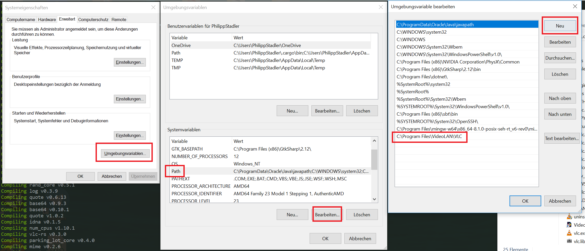

# fernspielapparat
Documentation and code of the _Fernspielapparat_ project live here.

It is a story telling device and you can learn more about what it
is and how you can work with it in the [Introduction](https://github.com/krachzack/fernspielapparat/blob/master/doc/Introduction.md).
When you have learned the basics you may want to check out some of
the [examples](examples/).

## fernspielapparat runtime
The source code in this repository is used to build the runtime.
It is the component running on the target device that enables
users to play phonebooks.

It can also be used for development and testing of phonebooks.

The runtime loads and evaluates phonebooks. For this, it accesses
hardware dials through an I2C protocol. System keyboard input is
supported on systems without a dial installed. It provides speech
output through _espeak_ and _libvlc_. An optional hardware bell
is supported through an I2C protocol.

### Installing
The runtime runs on Raspberry Pi 2 or similar systems and also on
common desktop operating systems.

#### Step 1: Install dependencies
The application needs other Software to run, so the first
step is to install these dependencies.

##### Dependencies for what?
For speech synthesis, installing `espeak` is recommended.
For systems other than Windows and Mac, it is required.
To play music and speech to the user, VLC is required.

#### Dependencies: Linux
Make sure `vlc` or `cvlc` is installed through your
favorite package manager. An I2C kernel module is
required for the hardware bell and hardware dial.
`espeak` is also required.

#### Dependencies: Windows
Install VLC through their web site if you have not done
so already. Then, make sure the VLC installation directory
is on the `Path` environment variable, so the runtime
can find it. On my system, `libvlc.dll` is located in
`C:\Program Files\VideoLAN\VLC`. Check yourself and
then add it to `Path` through system settings.

On a german locale, traverse through the screens like
this after you have found "Systemumgebungsvariablen bearbeiten"
in the system settings:

If this was too much German for you, there are a lot of
guides on the internet for setting environment variables
on Windows.

Installing `espeak` and adding it to your path is recommended.

#### Dependencies: Mac
Make sure VLC is installed on your system. `espeak` is
recommended, but not required.

#### Step 2: Install _fernspielapparat_ Executable
Binary releases contain the runtime as an executable file
`fernspielapparat` (or `fernspielapparat.exe`). You can run
it directly and move it anywhere you like to install it.

To make `fernspielapparat` available globally, you can add the
containing directory to your `PATH` environment variable or
move the binary to some directory that you know is on the
`PATH`, e.g. `/usr/bin` on many systems. Instead of moving,
you can place a symbolic link in the target directory - this
will make it easier for you to switch between versions later
on.

To build and install the runtime yourself, see the
[compilation guide](COMPILE.md).

### Running
Once the runtime is installed, you can run phonebooks with
`fernspielapparat your_phonebook_here.yaml`.

`fernspielapparat --demo` can be used instead of specifying
a file and loads a demo phonebook embedded in the runtime
executable. It contains speech synthesis and background music
appears after some seconds.

`fernspiealapparat --test` starts diagnostic mode. It will
try to ring the bell for one second and access speech
synthesis.

Use `fernspielapparat --help` for an overview of available
options.

## License
The fernspielapparat project is licensed under the GPLv3, since it
internally depends on espeak, which uses that license.
